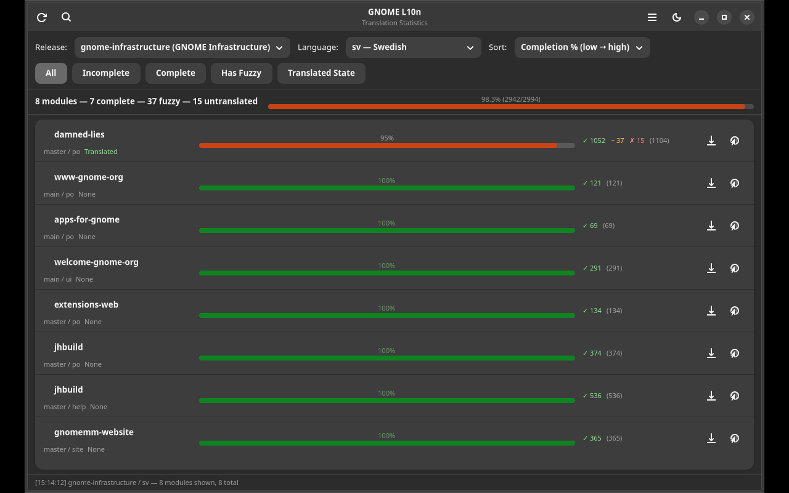

# GNOME L10n

GTK4/Adwaita translation statistics viewer for GNOME — powered by the l10n.gnome.org API.



## Features

- 📊 View translation stats for all GNOME modules per release
- 🌍 30 languages supported (Swedish default)
- 📈 Progress bars with translated/fuzzy/untranslated counts
- 🔍 Filter by module name, completeness
- 📤 CSV export with app branding
- 🔄 Automatic caching (1 hour)
- 🌙 Dark/light theme toggle
- 🌍 Translatable via gettext

## Data Source

All translation data comes from [l10n.gnome.org](https://l10n.gnome.org) REST API.

## Installation

```bash
pip install .
gnome-l10n
```

### Requirements

- Python 3.10+
- GTK4, libadwaita
- PyGObject

## License

GPL-3.0-or-later

## Author

Daniel Nylander <daniel@danielnylander.se>
